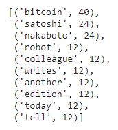
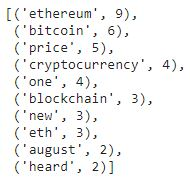
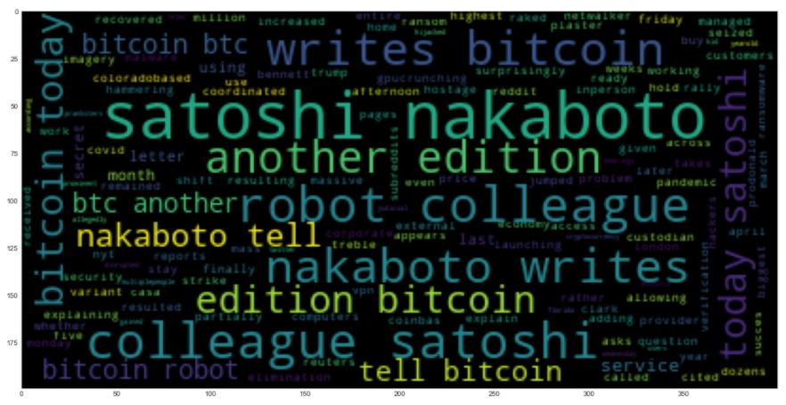
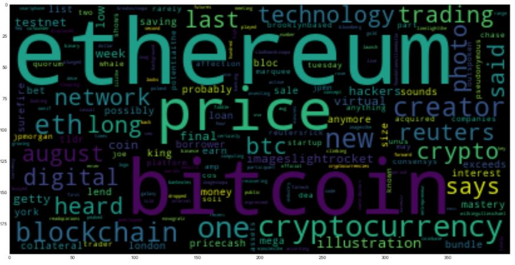

## Crypto Sentiment Summary

Based on the descriptive statistics Bitcoin has the highest mean positive score at 0.081050 compared to Ethereum at 0.050529. Although Ethereum had the highest negative (0.189000) and positive score (0.18100) compared to Bitcoin's scores at 0.071000 and 0.149000 respectively.

I beleive the the scores represent Ethereum better than Bitcoin after looking at the top 10 words and the word clouds for each of them (see below).  I would do some more research on Nakaboto Satoshi and the robot colleague as it seems to be an automated article generating bot that writes a story about Bitcoin everyday.  I believe doing a bit of deeper research into the actual articles associated with Nakaboto Satoshi is needed to determine relevancy to the sentiment of Bitcoin.

|Top 10 Bitcoin Words   |  Top 10 Ethereum Words   |
| ---                   |   ---                    |
|  |   |

#### Bitcoin Word Cloud 

#### Ethereum Word Cloud 